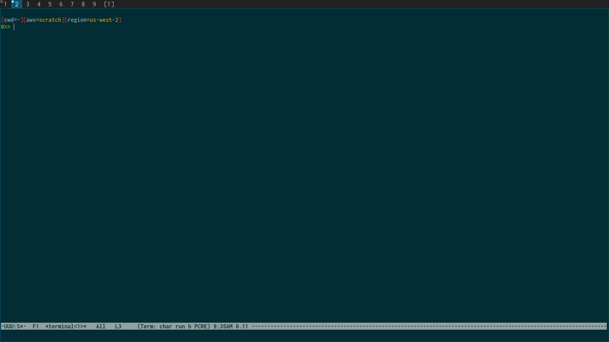

# notify

## why

sometimes popup messages are for great good.

## what

a cli that triggers a fullscreen graphical popup with text.

optionally includes a y/n prompt which will change the exit code.

## example



## install

`go get github.com/nathants/notify`

## usage

```
>> notify -h

notify the user of a message with a fullscreen popup. hit Q or ENTER to exit.

Usage: notify [--prompt] [--delay-seconds DELAY-SECONDS] MESSAGE

Positional arguments:
  MESSAGE                the message to display on screen

Options:
  --prompt, -p           prompt the user for a y/n response, and exit 0/1 accordingly
  --delay-seconds DELAY-SECONDS, -d DELAY-SECONDS
                         delay seconds before accepting user input for prompted y/n
  --help, -h             display this help and exit
```
